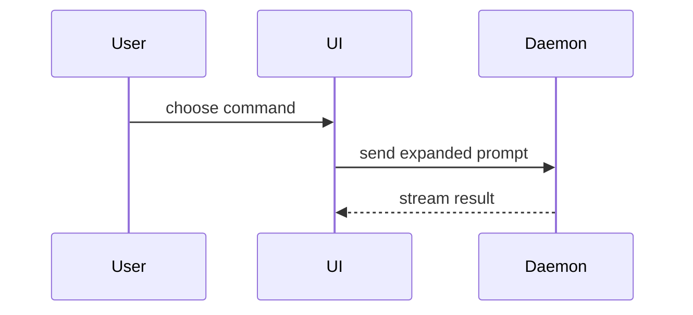

Help the user understand the current topic of conversation visually. Skip the preamble and keep prose brief. Pick the smallest view that makes the key point clear.

- Show logic or an algorithm as pseudocode:

```text
on(save)
  if content is unchanged
    return cached result
  write new content
  return fresh result
```

- Show runtime control flow as a call tree:

```text
submitForm
  createSession
    persistPrompt
    launchAgent
  navigateToSession
```

- Show UI structure as a component tree, including state and module boundaries that matter:

```tsx
<SessionPage> (apps/example/src/routes/session.tsx)
  useSessionEvents()
  <SessionToolbar>
    <RunSkillButton> (packages/ui)
```

- Show file responsibility or a broad refactor as a shallow file tree:

```text
src/
├── commands/       # parses user actions
├── sessions/       # owns session state
└── transport/      # sends API requests
```

- Show component interaction, control flow, or data flow with Mermaid:



- Use `diff` when the point is what changes and the surrounding shape already exists. Match the diff shape to the topic.

For a component change:

```diff
 <SessionPage>
   useSessionEvents()
   <SessionToolbar>
+    <RunSkillButton />
   <SessionTimeline>
+    <SkillResultCard />
```

For a file-layout change:

```diff
 src/
 ├── commands/
+│   └── show-me.ts       # expands the slash command
 ├── sessions/
-└── transport.ts
+└── transport/
+    ├── client.ts
+    └── stream.ts
```

For a call-tree or call-stack change:

```diff
 submitForm
   createSession
     persistPrompt
+    expandSkillMention
     launchAgent
-  navigateToSession
+  navigateToSession
+    subscribeToEvents
```

For a state or control-flow change:

```diff
 on(save)
-  write content
+  if content is unchanged
+    return cached result
+  write new content
+  invalidate cache
```

- Show the whole block when most of it is new, when omitted context would hide ownership or order, or when the user needs a copyable target shape:

```ts
function expandSkill(command: string): string {
  const skillName = command.slice(1)
  return `use the ${skillName} skill`
}
```

- For a visual UI, layout, state comparison, or concept too dense for Mermaid, write one focused local HTML page. Match the product's colors, type, spacing, and components; use real labels and data; support desktop and mobile.

### local HTML pages

Never publish a Claude Artifact for this skill. Pages are plain files inside the project, opened as `file://` URLs.

1. Get the folder — this creates `./show-me/` in the current project and drops the shared stylesheet in it:

```
Bash(DIR=$(~/.agents/skills/show-me/show.sh --where))
```

It resolves to `<git root>/show-me`, or `./show-me` outside a repo. The folder self-ignores via its own `.gitignore`, so git never sees the pages and the project's `.gitignore` is left alone.

2. Write the page to `$DIR/<slug>.html`, where `<slug>` is a short stable kebab-case name for the topic (`session-lifecycle`, not `show-me-1`). Link the stylesheet, which carries readable light/dark defaults and print rules:

```html
<link rel="stylesheet" href="_assets/base.css">
```

3. Then run:

```
Bash(~/.agents/skills/show-me/show.sh <slug>)
```

`show.sh` opens the page if no tab has it, and otherwise tells the browser to reload the tab that does. Either way the user can just hit Cmd+R — it is an ordinary file, so nothing in the page depends on the script.

- **Reuse the same slug** when revising a view, so the open tab updates in place. Pick a new slug only for a genuinely new subject.
- Revise by editing `$DIR/<slug>.html` and re-running `show.sh <slug>`; never write a new file per revision.
- `show.sh <slug> --pdf` also renders `$DIR/<slug>.pdf` via headless Chromium and opens it. Only when the user asks for a PDF — the page already prints cleanly with Cmd+P.
- `show.sh --clean` deletes the whole folder. Mention it when the user is done with a set of pages.

Because `base.css` already styles `body`, `h1`–`h3`, `.card`, `pre`, `table`, and `svg`, write only the markup and the CSS specific to this diagram. Do not restate baseline styling.

### guidance

Place each visual next to the short text it supports. Keep only the calls, files, props, states, and boundaries needed to answer the user's current question or the options to resolve the current discussion point.

You may use one of these, you may use several, it is unlikely you will use all of them. Use your judgement and don't overwhelm the user.
